# 運動方程式とその導出

English edition: [`docs_en/models.md`](../docs_en/models.md)

ライブラリが実装している式を、それが依拠する仮定から順に導出します。各節は「仮定
→ 導出 → コードが使う形の結果」という構成です。図は
[`python/tools/make_model_figures.py`](../python/tools/make_model_figures.py)
が生成します。最後の3枚はライブラリ自身が計算した結果なので、コードと図がずれる
ことはありません（図中のラベルは記号と英語で、日英共通です）。

| # | 節 | 依拠する仮定 |
|---|---|---|
| 0 | [座標系と記号](#0-座標系記号符号) | 定義 |
| 1 | [ユニサイクル / 差動二輪](#1-ユニサイクル--差動二輪) | 剛体は瞬間回転中心まわりに回る |
| 2 | [アッカーマン幾何](#2-アッカーマン幾何) | 全輪が横すべりなしで転がる |
| 3 | [キネマティック二輪](#3-キネマティック二輪) | 同上を1トラックに縮約 |
| 4 | [線形2自由度](#4-線形2自由度横運動モデル) | 微小角・線形タイヤ・ $v_x$ 一定 |
| 5 | [非線形単輪](#5-非線形単輪ダイナミック二輪) | 車体固定系のニュートン・オイラー |
| 6 | [キネマティック／ダイナミック ブレンド](#6-キネマティックダイナミック-ブレンド) | $1/v_x$ 特異点の除去 |
| 7 | [ダブルトラック](#7-ダブルトラック4輪) | 4つの接地点と荷重移動 |
| 8 | [タイヤモデル](#8-タイヤモデル) | ブラシ接地面 |
| 9 | [積分器](#9-積分器) | テイラー展開 |

---

## 0. 座標系・記号・符号

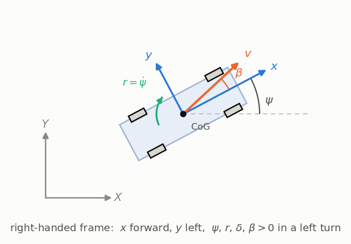

車体固定の右手系をとります： $x$ が前方、 $y$ が左方、 $z$ が上方。ヨー角 $\psi$
はグローバル $X$ 軸から反時計回りを正にとり、ヨーレートは $r = \dot\psi$ です。
したがって舵角 $\delta > 0$ は左旋回であり、 $r > 0$ を生みます。

| 記号 | 意味 |
|---|---|
| $m$, $I_z$ | 質量、重心まわりのヨー慣性 |
| $l_f$, $l_r$, $L = l_f + l_r$ | 重心-前軸間、重心-後軸間、ホイールベース |
| $T_f$, $T_r$ | 前・後トレッド |
| $h$ | 重心高 |
| $C_f$, $C_r$ | **軸あたり**コーナリングスティフネス $[\mathrm{N/rad}]$ |
| $\mu$ | 路面摩擦係数 |
| $v_x$, $v_y$ | 重心における車体座標系の速度成分 |
| $\beta$ | 車体スリップ角、 $\tan\beta = v_y/v_x$ |
| $\alpha$ | タイヤスリップ角 |

全モデルが共有する唯一の関係が、車体速度をグローバル系へ変換する式です。回転行列
$R(\psi)$ を使って

$$
\begin{bmatrix}
\dot X \\
\dot Y
\end{bmatrix} =
\begin{bmatrix}
\cos\psi & -\sin\psi \\
\sin\psi & \cos\psi
\end{bmatrix}
\begin{bmatrix}
v_x \\
v_y
\end{bmatrix}
$$

すなわち $\dot X = v_x\cos\psi - v_y\sin\psi$、
$\dot Y = v_x\sin\psi + v_y\cos\psi$。 $v_y = 0$ を仮定するモデルではこれが
$\dot X = v\cos\psi$、 $\dot Y = v\sin\psi$ に縮退します。

**車体座標系での加速度。** グローバル速度を微分して車体系へ戻すと、動力学モデルが
必ず必要とする項が出ます。 $\mathbf{v} = (v_x, v_y)$、
$\boldsymbol\omega = r\ \hat z$ とすると

$$
\mathbf{a}_{\text{body}} = \dot{\mathbf{v}} + \boldsymbol\omega \times \mathbf{v}
= (\dot v_x - r v_y,\ \dot v_y + r v_x)
$$

外積の項は力ではなく、座標系が回転していることから生じます。4・5・7 節の式はすべて
ここから始まります。

---

## 1. ユニサイクル / 差動二輪

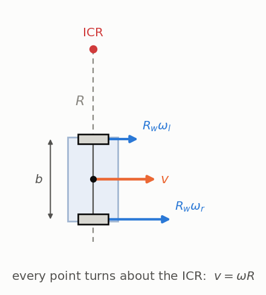

**仮定。** 車輪はすべりなしで転がるので、車軸方向の速度は生じません：
$v_y = 0$。

**導出。** 平面内の剛体は瞬間回転中心（ICR）まわりに回転します。車体中心が ICR
から距離 $R$ にあり、車体が $\omega$ で回るとき、定義から

$$
v = \omega R
$$

2つの車輪は同一車軸上、中心から $\pm b/2$ の位置にあるので、それぞれの回転半径は
$R \mp b/2$ です。すべりなしで転がるなら、各輪の接地点速度は転がり速度
$R_w\omega_l$、 $R_w\omega_r$ に等しく、

$$
R_w \omega_l = \omega\left(R - \frac{b}{2}\right),
\qquad
R_w \omega_r = \omega\left(R + \frac{b}{2}\right)
$$

2式を足すと $b$ が消えて $R_w(\omega_r + \omega_l) = 2\omega R = 2v$、引くと $R$
が消えて $R_w(\omega_r - \omega_l) = \omega b$ が得られます。

**結果。**

$$
v = \frac{R_w(\omega_r + \omega_l)}{2},
\qquad
\omega = \frac{R_w(\omega_r - \omega_l)}{b}
$$

$v_y = 0$ なので、位置は 0 節の変換からそのまま従います。

$$
\dot x = v\cos\psi,
\qquad
\dot y = v\sin\psi,
\qquad
\dot\psi = \omega
$$

**なぜ自動車のモデルとして誤りか。** $\omega_r = -\omega_l$ とおくと $v = 0$ かつ
$\omega \ne 0$、つまり $R = v/\omega = 0$ でその場旋回します。導出のどこにも $R$
の下限は現れません。2輪を共通の操舵幾何で縛っていないからです。プランナ側の抽象、
またはスキッドステア機に限定して使ってください。

---

## 2. アッカーマン幾何

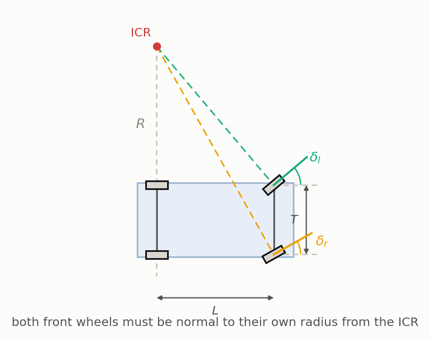

**仮定。** 全輪が横すべりなしで転がるので、各輪の速度はその輪の面内にあります。
車輪の速度は ICR とその輪を結ぶ線に直交するので、**すべての車輪面は ICR からの
自分の半径に直交していなければならない**。アッカーマン幾何はこの一文がすべてです。

**ICR がどこにあるか。** 後輪は操舵されないので面は $x$ 方向を向き、半径は $y$
方向を向きます。したがって ICR は後軸の延長線上にあります。後軸中心からの距離を
$R$ とし、その中心を原点にとれば ICR は $(0, R)$ です。

**前輪。** 前左輪は後軸中心から見て $(L, +T_f/2)$ にあります。この輪から ICR へ
向かうベクトルは $(-L,\ R - T_f/2)$ で、車輪面はこれに直交しなければならないので
舵角は

$$
\tan\delta_l = \frac{L}{R - T_f/2}
\qquad\Longleftrightarrow\qquad
\cot\delta_l = \frac{R - T_f/2}{L}
$$

に決まります。前右輪は $(L, -T_f/2)$ なので $\cot\delta_r = (R + T_f/2)/L$。

**結果 — 理想アッカーマン条件。** 2式の差をとると $R$ が消えます。

$$
\cot\delta_{\text{outer}} - \cot\delta_{\text{inner}} = \frac{T_f}{L}
$$

等価な二輪（バイシクル）モデルでは $\cot\delta = R/L$ なので、同じ組を $\delta$ の
まわりに書き直せます。

$$
\cot\delta_l = \cot\delta - \frac{T_f}{2L},
\qquad
\cot\delta_r = \cot\delta + \frac{T_f}{2L}
$$

これが `ackermann.hpp` の計算内容です。実車のラックはこれを厳密には実現しないので、
本ライブラリは比 $k$（`ackermann_ratio`）で平行操舵との線形ブレンドを取ります。

$$
\delta_i = \delta + k\ (\delta_{i,\text{ideal}} - \delta)
$$

$k = 1$ が理想アッカーマン、 $k = 0$ が平行操舵です。実車では 60〜80 % 程度が普通で、
`ackermannError()` はその結果生じる外輪側のずれを返します。

**車輪速。** 剛体では、車体座標 $(x_p, y_p)$ にある点の速度は
$\mathbf{v}_p = \mathbf{v} + \boldsymbol\omega \times \mathbf{r}_p$、すなわち

$$
\mathbf{v}_p = (v_x - r\ y_p,\ \ v_y + r\ x_p)
$$

です。車輪速センサが測るのは**車輪面方向の成分**です。後輪（ $x_p = 0$、面は $x$
方向）ではそれは $x$ 成分そのもので、

$$
v_{rl} = v - \frac{T_r}{2} r,
\qquad
v_{rr} = v + \frac{T_r}{2} r
$$

前輪（ $x_p = L$、面は $\delta$ 方向）では $(v \mp T_f r/2,\ L r)$ を
$(\cos\delta,\ \sin\delta)$ に射影して

$$
v_{fl} = \left(v - \frac{T_f}{2} r\right)\cos\delta_l + L r \sin\delta_l,
\qquad
v_{fr} = \left(v + \frac{T_f}{2} r\right)\cos\delta_r + L r \sin\delta_r
$$

---

## 3. キネマティック二輪

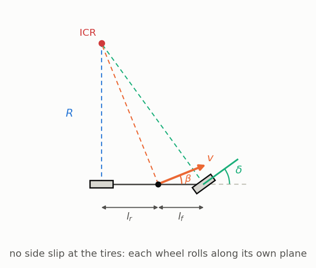

**仮定。** 2節と同じくタイヤ横すべりゼロ。さらに各軸の左右輪を1輪に集約します。
タイヤは経路が要求する横力をいくらでも出せるものとします。

**導出。** 後軸中心を基準点にとり、その速度を $v$ とします。後輪は操舵されないので
速度は $x$ 方向、つまり後軸点の車体速度は $(v, 0)$ です。2節の剛体関係に
$x_p = L$ を入れると、前軸点の速度は

$$
\mathbf{v}_f = (v,\ L r)
$$

前輪も横すべりなしで転がるので、 $\mathbf{v}_f$ は角度 $\delta$ の車輪面内に
なければなりません。したがって

$$
\tan\delta = \frac{L r}{v}
$$

**結果 — 後軸基準。**

$$
\dot x = v\cos\psi,
\qquad
\dot y = v\sin\psi,
\qquad
\dot\psi = \frac{v\tan\delta}{L},
\qquad
\dot v = a
$$

これは $R = L/\tan\delta$ と等価で、前節が構成した ICR と同じものです。

**重心基準。** 重心は後軸より $l_r$ 前にあるので、その速度は $(v, l_r r)$ となり、
車体軸方向を向き**ません**。車体スリップ角が直ちに従います。

$$
\tan\beta = \frac{l_r r}{v} = \frac{l_r \tan\delta}{L}
$$

ここで $v$ が**重心**速度を表すなら後軸速度は $v\cos\beta$ なので、
$\dot\psi = v_{\text{rear}}\tan\delta/L$ に代入して

$$
\dot x = v\cos(\psi + \beta),
\qquad
\dot y = v\sin(\psi + \beta),
\qquad
\dot\psi = \frac{v\cos\beta\ \tan\delta}{L}
$$

**前軸基準。** $v$ が前輪速度なら後軸速度は $v\cos\delta$ で、
$\dot\psi = v\cos\delta\tan\delta/L$ より

$$
\dot x = v\cos(\psi + \delta),
\qquad
\dot y = v\sin(\psi + \delta),
\qquad
\dot\psi = \frac{v\sin\delta}{L}
$$

3つの形は同じ車両を記述しており、違うのは「どの点を積分するか」だけです。
`ReferencePoint` がこれを選びます。

**仮定が破れる境界を数値で。** 定常旋回では前軸が $F_{yf} = m a_y l_r/L$ を負担
します（4節）。したがって実際に必要なスリップ角は $\alpha_f \approx F_{yf}/C_f$、

$$
\alpha_f \approx \frac{m\ l_r}{L\ C_f}\ a_y
$$

乗用車プリセット（ $m = 1600$、 $l_r = 1.5$、 $L = 2.7$、 $C_f = 90\ 000$）では
$\mathrm{m/s^2}$ あたり $9.9 \times 10^{-3}$ rad なので、 $a_y = 0.4\ g$ では無視
している横すべり角が約 $2.2^\circ$ に達します。これは中程度の旋回半径における舵角
そのものと同じオーダーです。 $0.4\ g$ という経験則の出どころはここにあり、これを
超えるとキネマティックモデルがヨーレートを過大評価します
（`examples/step_steer.cpp`）。

**操舵アクチュエータつき。** `KinematicBicycleSteerModel` はレート制限つきの一次
遅れを追加します。

$$
\dot\delta = \mathrm{clamp}\left(\frac{\delta_{\text{cmd}} - \delta}{\tau},\ \pm\dot\delta_{\max}\right)
$$

---

## 4. 線形2自由度（横運動）モデル

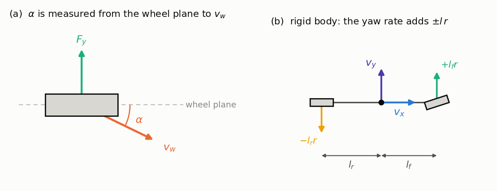

**仮定。** $v_x$ 一定、微小角（ $\sin\delta \approx \delta$、
$\cos\delta \approx 1$、 $\arctan u \approx u$）、線形タイヤ $F_y = C\alpha$、
荷重移動なし。

**第1段 — スリップ角。** 剛体関係より、横方向速度は前軸で $v_y + l_f r$、後軸で
$v_y - l_r r$ です（上図 b）。スリップ角は車輪面から速度ベクトルまでの角なので

$$
\alpha_f = \delta - \arctan\frac{v_y + l_f r}{v_x}
\approx \delta - \frac{v_y + l_f r}{v_x},
\qquad
\alpha_r \approx -\frac{v_y - l_r r}{v_x}
$$

**第2段 — ニュートン・オイラー。** 0節の車体系加速度を使い、 $\sin\delta$ の項を
落とすと

$$
m(\dot v_y + v_x r) = F_{yf} + F_{yr},
\qquad
I_z \dot r = l_f F_{yf} - l_r F_{yr}
$$

**第3段 — 線形タイヤを代入。** $F_{yf} = C_f\alpha_f$、 $F_{yr} = C_r\alpha_r$ を
入れると、横方向の式は

$$
m(\dot v_y + v_x r) = C_f\delta - \frac{C_f + C_r}{v_x}v_y -
\frac{l_f C_f - l_r C_r}{v_x}r
$$

ヨーの式は

$$
I_z\dot r = l_f C_f\delta - \frac{l_f C_f - l_r C_r}{v_x}v_y -
\frac{l_f^2 C_f + l_r^2 C_r}{v_x}r
$$

**結果。** $m v_x r$ を右辺に移し、両辺を割ると

$$
\frac{d}{dt}
\begin{bmatrix}
v_y \\
r
\end{bmatrix} =
\begin{bmatrix}
-\dfrac{C_f + C_r}{m v_x} & -v_x - \dfrac{l_f C_f - l_r C_r}{m v_x} \\
-\dfrac{l_f C_f - l_r C_r}{I_z v_x} & -\dfrac{l_f^2 C_f + l_r^2 C_r}{I_z v_x}
\end{bmatrix}
\begin{bmatrix}
v_y \\
r
\end{bmatrix} +
\begin{bmatrix}
\dfrac{C_f}{m} \\
\dfrac{l_f C_f}{I_z}
\end{bmatrix}
\delta
$$

`stateMatrix()` と `inputMatrix()` はまさにこの $A$, $B$ を返すので、LQR や MPC の
設計プラント、あるいはオブザーバにそのまま載せられます。

### 4.1 定常円旋回 — つり合いから導く

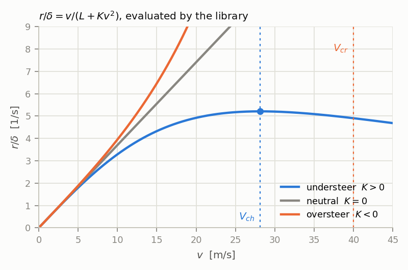

`linear_analysis.hpp` の解析解は、 $A$, $B$ からよりも平衡条件から導くほうが速い
です。半径 $R$ の定常旋回ではヨー加速度がゼロなので

$$
F_{yf} + F_{yr} = m a_y,
\qquad
l_f F_{yf} - l_r F_{yr} = 0
$$

この2式を解くと、軸荷重が距離に反比例して配分されることが分かります。

$$
F_{yf} = \frac{m a_y l_r}{L},
\qquad
F_{yr} = \frac{m a_y l_f}{L}
$$

したがって各軸が必要とするスリップ角は $\alpha_f = m a_y l_r/(L C_f)$、
$\alpha_r = m a_y l_f/(L C_r)$ です。舵角は幾何的な分 $L/R$ に**加えて**2つの
スリップ角の差を供給しなければなりません。

$$
\delta = \frac{L}{R} + \alpha_f - \alpha_r
= \frac{L}{R} + \frac{m}{L}\left(\frac{l_r}{C_f} - \frac{l_f}{C_r}\right)a_y
$$

**結果 — アンダーステア勾配。**

$$
K = \frac{m}{L}\left(\frac{l_r}{C_f} - \frac{l_f}{C_r}\right)
\quad [\mathrm{rad/(m/s^2)}],
\qquad
\delta = \frac{L}{R} + K a_y
$$

$a_y = v^2/R$ を代入すると $\delta = (L + Kv^2)/R$、そして $r = v/R$ なので

$$
\frac{r}{\delta} = \frac{v}{L + K v^2},
\qquad
\frac{a_y}{\delta} = \frac{v^2}{L + K v^2}
$$

**特性速度。** $K > 0$ のときゲインは極大を持ちます。微分して
$\frac{d}{dv}\frac{v}{L+Kv^2} = 0$ を課すと $L + Kv^2 = 2Kv^2$、すなわち

$$
V_{ch} = \sqrt{\frac{L}{K}}
$$

この速度でのゲインは $V_{ch}/(2L)$ となり、ニュートラルステア時の値 $v/L$ の
ちょうど半分です。「ヨーレートゲインが半分になる速度」という通常の定義を、仮定
するのではなくここで導いたことになります。

**限界速度。** $K < 0$ では分母がゼロになる速度が存在し、

$$
V_{cr} = \sqrt{-\frac{L}{K}}
$$

定常ゲインが発散します。これを超えると車両は不安定です。

**車体スリップ角。** 重心における $\beta$ は、幾何的な分 $l_r/R$ から後軸が実際に
使っているスリップ角を差し引いたものです。

$$
\beta = \frac{l_r}{R} - \alpha_r
= \frac{1}{R}\left(l_r - \frac{m l_f v^2}{L C_r}\right)
$$

$v = \sqrt{l_r L C_r/(m l_f)}$ で符号が反転します。これより低速では左旋回で
$\beta > 0$（キネマティックモデルが常に予測する符号）、高速では $\beta < 0$ です。
この符号反転が、キネマティックモデルの妥当限界を示す最も分かりやすい単一の症状です。

**ニュートラルステアポイントとスタティックマージン。** 車両をヨーなしの純横運動で
拘束すると、前後軸は同じスリップ角 $\alpha$ になります。軸力は $C_f\alpha$ と
$C_r\alpha$ で、その合力の作用点は前軸からモーメントがつり合う距離、すなわち
$x_{NSP}(C_f + C_r)\alpha = L\ C_r\alpha$ から

$$
x_{NSP} = \frac{L C_r}{C_f + C_r},
\qquad
SM = \frac{x_{NSP} - l_f}{L}
$$

$SM > 0$ はニュートラルステアポイントが重心より後方にあることを意味します。これは
$K > 0$ と同じ条件で、どちらも $l_r C_r > l_f C_f$ に帰着します。

**ヨーモード。** $A$ の特性方程式は
$\lambda^2 - (\mathrm{tr}\ A)\lambda + \det A = 0$ です。標準的な2次系の形
$\lambda^2 + 2\zeta\omega_n\lambda + \omega_n^2$ と係数比較して

$$
\omega_n = \sqrt{\det A},
\qquad
\zeta = -\frac{\mathrm{tr}\ A}{2\sqrt{\det A}}
$$

---

## 5. 非線形単輪（ダイナミック二輪）

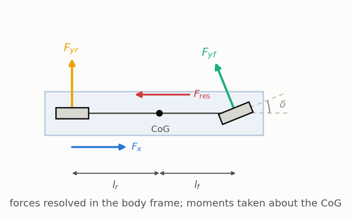

**仮定。** 剛体、各軸1輪、平面運動。微小角近似はせず、タイヤモデルにも制限を
置きません。荷重移動は準静的に扱います。

**導出。** 0節の回転系加速度を使って、車体座標系で力をつり合わせます。前輪の横力は
**操舵された**車輪面に直交して作用するので、 $x$ 方向へ $-F_{yf}\sin\delta$、
$y$ 方向へ $F_{yf}\cos\delta$ の成分を持ちます。

$$
\begin{aligned}
m(\dot v_x - v_y r) &= F_x - F_{yf}\sin\delta - F_{\text{res}} \\
m(\dot v_y + v_x r) &= F_{yf}\cos\delta + F_{yr} \\
I_z \dot r &= l_f F_{yf}\cos\delta - l_r F_{yr}
\end{aligned}
$$

**スリップ角**は 4 節と同じ軸速度から、今度は線形化せずに

$$
\alpha_f = \delta - \arctan\frac{v_y + l_f r}{v_x},
\qquad
\alpha_r = -\arctan\frac{v_y - l_r r}{v_x}
$$

`guardDenominator` が $v_x$ に下限を設けるので、停止時も微分は有限に保たれます。

**前後方向の荷重移動。**

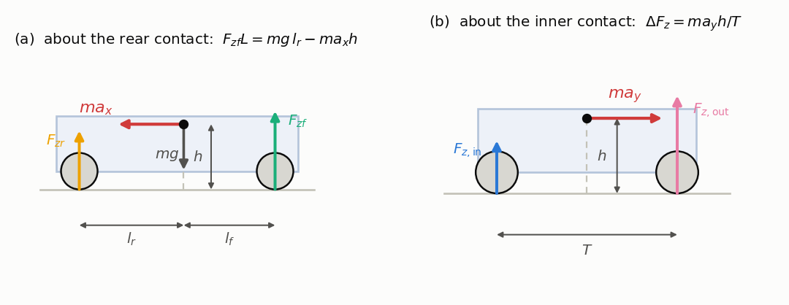

後輪接地点まわりのモーメントをとります（図 a）。重量 $mg$ はその $l_r$ 前方に、
慣性力 $m a_x$ は高さ $h$ で後ろ向きに、前軸荷重 $F_{zf}$ は距離 $L$ に作用するので

$$
F_{zf}L = m g\ l_r - m a_x h
$$

$F_{zf} + F_{zr} = mg$ と合わせて

$$
\Delta F_z = \frac{m a_x h}{L},
\qquad
F_{zf} = \frac{m g l_r}{L} - \Delta F_z,
\qquad
F_{zr} = \frac{m g l_f}{L} + \Delta F_z
$$

**走行抵抗。**

$$
F_{\text{res}} = \underbrace{\tfrac{1}{2}\rho C_d A\ v_x |v_x|}_{\text{空気抵抗}} +
\underbrace{\mu_{rr}\ m g \tanh\frac{v_x}{0.1}}_{\text{転がり抵抗}}
$$

係数 $\tfrac{1}{2}\rho C_d A$ がパラメータ `drag_area`
$[\mathrm{N/(m/s)^2}]$、 $\mu_{rr}$ が `rolling_resistance` です。 $\tanh$ は
$\mathrm{sign}(v_x)$ の代わりで、停止付近で力がチャタリングせず滑らかに反転する
ようにしています。 $0.1$ m/s がその遷移幅です。

---

## 6. キネマティック／ダイナミック ブレンド

**問題。** どちらのスリップ角にも $\arctan(\cdot/v_x)$ が入っています。
$v_x \to 0$ で引数が発散するため、いくら小さい $v_y$ でもスリップ角は $\pm\pi/2$
に近づき、タイヤ力は飽和します。低速域で単輪モデルは「精度が悪い」のではなく
**誤り**です。横方向のダイナミクスが硬くなり、力の符号が数値ノイズで決まって
しまいます。

**対策。** 低速側 0、高速側 1 のブレンド係数を使って、**微分そのもの**を動力学解と
「キネマティック解への一次引き込み」との間で補間します。

$$
\lambda = \mathrm{clamp}\left(\frac{|v_x| - v_{lo}}{v_{hi} - v_{lo}},\ 0,\ 1\right)
$$

$$
\begin{aligned}
\dot v_y &= \lambda\ \dot v_{y,\text{dyn}} + (1 - \lambda)\frac{v_{y,\text{kin}} - v_y}{\tau} \\
\dot r &= \lambda\ \dot r_{\text{dyn}} + (1 - \lambda)\frac{r_{\text{kin}} - r}{\tau}
\end{aligned}
$$

キネマティック側の目標値は3節から

$$
v_{y,\text{kin}} = v_x \tan\beta_{\text{kin}},
\qquad
r_{\text{kin}} = \frac{v_x \cos\beta_{\text{kin}} \tan\delta}{L}
$$

**なぜ代入ではなく一次引き込みなのか。** $v_y = v_{y,\text{kin}}$ と直接代入すると、
$\delta$ が変わるたびに状態量が不連続になります。
$\dot v_y = (v_{y,\text{kin}} - v_y)/\tau$ という形は、キネマティック解を不動点に
持つ安定な一次フィルタなので、状態は時定数 $\tau$ でそこへ収束しつつ微分可能な
まま保たれます。積分器が必要とするのはこの微分可能性です。 $v_{hi}$ 以上では
$\lambda = 1$ となり、素のダイナミックモデルとビット単位で一致します（移植テストは
これを $10^{-12}$ で検査しています）。

---

## 7. ダブルトラック（4輪）

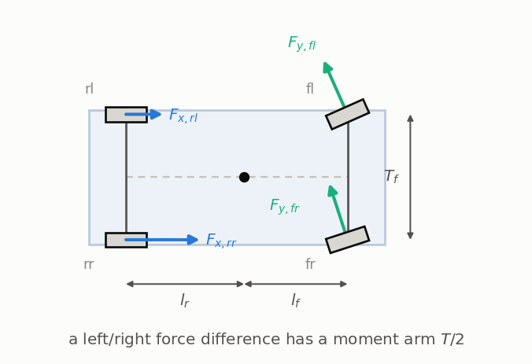

**仮定。** 4つの接地点、輪別の荷重と力、前後・左右双方向の準静的荷重移動、そして
左右荷重移動のうち前軸が受け持つ割合を表すロール剛性配分 $k_f$。

**輪別スリップ角。** 剛体の速度関係
$\mathbf{v}_p = (v_x - r y_p,\ v_y + r x_p)$ を各輪位置に適用します。前左輪
$(l_f, +T_f/2)$ なら $(v_x - T_f r/2,\ v_y + l_f r)$、以下同様に

$$
\begin{aligned}
\alpha_{fl} &= \delta_l - \arctan\frac{v_y + l_f r}{v_x - T_f r/2},
&\qquad
\alpha_{fr} &= \delta_r - \arctan\frac{v_y + l_f r}{v_x + T_f r/2} \\
\alpha_{rl} &= -\arctan\frac{v_y - l_r r}{v_x - T_r r/2},
&\qquad
\alpha_{rr} &= -\arctan\frac{v_y - l_r r}{v_x + T_r r/2}
\end{aligned}
$$

内輪ほど $v_x$ が小さくなります。これはまさに単輪モデルが表現できない効果です。

**荷重移動。** 前後方向は5節の軸レベルの結果そのものです。左右方向は内輪接地点
まわりのモーメントをとります（5節の図 b）。慣性力 $m a_y$ が高さ $h$、トレッド
$T$ に作用するので総移動量は $m a_y h / T$ です。これをロール剛性配分で前後軸に
振り分けて

$$
\begin{aligned}
F_{zf,\text{axle}} &= \frac{m g l_r}{L} - \frac{m a_x h}{L},
&\qquad
F_{zr,\text{axle}} &= \frac{m g l_f}{L} + \frac{m a_x h}{L} \\
\Delta F_{z,\text{front}} &= \frac{m a_y h k_f}{T_f},
&\qquad
\Delta F_{z,\text{rear}} &= \frac{m a_y h (1 - k_f)}{T_r}
\end{aligned}
$$

構成上、4輪の荷重の総和は常に $mg$ です。単体テストはこの恒等式を直接検査して
います。

**循環参照と、その断ち切り方。** 荷重は $a_x, a_y$ に依存し、それらはタイヤ力に
依存し、タイヤ力は荷重に依存します。本ライブラリは**1パス**で解きます：静荷重で
力を計算 → そこから $a_x, a_y$ を推定 → 荷重を再計算 → 力を再計算。不動点まで
反復しないので実行時間が決定的になり、最悪実行時間を提示できます。ECU 上では、
最後の数 % の精度よりこちらが重要です。

**ヨーモーメント。** 4輪について $\mathbf{r}_i \times \mathbf{F}_i$ を足すと
$M_z = \sum_i (x_i F_{y,i} - y_i F_{x,i})$ となり、4つの位置を代入して

$$
M_z = l_f\left(F_{y,fl} + F_{y,fr}\right) - l_r\left(F_{y,rl} + F_{y,rr}\right) +
\frac{T_f}{2}\left(F_{x,fr} - F_{x,fl}\right) +
\frac{T_r}{2}\left(F_{x,rr} - F_{x,rl}\right)
$$

ここで $F_x$, $F_y$ は車体座標へ回転済みです。後ろ2項がこのモデルの存在理由です。
左右の**前後力**差はモーメント腕 $T/2$ を持つので、トルクベクタリングや左右制動力差
によるヨー制御がここで初めて現れます。これより上のモデルには一切見えません。

---

## 8. タイヤモデル

**線形。** $F_y = C_\alpha\alpha$ を $|F_y| \le \mu F_z$ でクリップ。解析には
便利ですが限界近傍では誤りです。クリップ直前までスティフネスが $C_\alpha$ のまま
だからです。

### 8.1 ブラシモデル — Fiala の3次式はどこから来るか

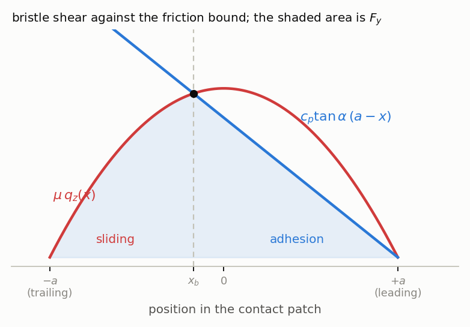

**設定。** トレッドを独立な弾性ブラシ（毛）の集まりとみなします。毛は前縁
$x = +a$ でたわみゼロで接地に入り、後縁 $x = -a$ へ向かって運ばれます。路面に
くっついている間、横たわみは移動距離とともに増えるので、単位長さあたりのせん断力は

$$
t_y(x) = c_p \tan\alpha\ (a - x)
$$

です（ $c_p$ は単位長さあたりのブラシ剛性）。くっついていられるのは、これが局所の
摩擦上限を下回る間だけです。接地圧には通常の放物線分布をとり、
$\int_{-a}^{a} q_z\ dx = F_z$ となるよう正規化すると

$$
\mu\ q_z(x) = \frac{3\mu F_z}{4a^3}\left(a^2 - x^2\right)
$$

**遷移点。** 2曲線が交わるところで粘着が終わります。 $t_y = \mu q_z$ とおき、共通
因子 $(a - x)$ を約分すると

$$
c_p \tan\alpha = \frac{3\mu F_z}{4a^3}(a + x_b)
\qquad\Longrightarrow\qquad
x_b = \frac{4a^3 c_p \tan\alpha}{3\mu F_z} - a
$$

$x_b$ より前縁側では毛は粘着し、後縁側ではすべって $\mu q_z$ しか伝えません。横力は
図の網掛け面積です。

$$
F_y = \int_{x_b}^{a} c_p\tan\alpha\ (a - x)\ dx + \int_{-a}^{x_b} \mu\ q_z(x)\ dx
$$

**コーナリングスティフネス。** $\alpha$ が小さいうちは全域が粘着（ $x_b \le -a$）
なので、第1項だけが接地全長にわたって残ります。

$$
F_y = c_p\tan\alpha\int_{-a}^{a}(a - x)\ dx = 2 c_p a^2 \tan\alpha
\qquad\Longrightarrow\qquad
C_\alpha = 2 c_p a^2
$$

**全すべり。** $x_b \ge a$、すなわち
$4a^3 c_p\tan\alpha/(3\mu F_z) \ge 2a$ で接地全域がすべります。
$C_\alpha = 2c_pa^2$ を使うとこれは $\tan\alpha \ge 3\mu F_z/C_\alpha$ となり、

$$
\alpha_{sl} = \arctan\frac{3\mu F_z}{C_\alpha}
$$

**結果。** 2つの積分を実行し、すべてを $C_\alpha$, $\mu$, $F_z$ で書き直すと簡潔な
閉形式になります。

$$
F_y = \mu F_z\left[1 - \left(1 - \frac{C_\alpha|\tan\alpha|}{3\mu F_z}\right)^{3}\right]\mathrm{sign}(\tan\alpha)
$$

これを項別に展開すると、コードが評価している3次式そのものになります。

$$
F_y = C_\alpha \tan\alpha -
\frac{C_\alpha^2}{3\mu F_z}\left|\tan\alpha\right|\tan\alpha +
\frac{C_\alpha^3}{27\mu^2 F_z^2}\tan^3\alpha
$$

どちらの形からも2つの極限が読み取れます。原点での傾きは $C_\alpha$、そして
$|\tan\alpha| = 3\mu F_z/C_\alpha$ で括弧の中が $1$ に達するので
$F_y = \mu F_z$ となり、以降は一定です。

### 8.2 Pacejka Magic Formula

こちらは導出ではなく経験式です。形は導かれたものではなく選ばれたものです。

$$
F_y = D \sin\Big(C \arctan\big(B\alpha - E(B\alpha - \arctan B\alpha)\big)\Big),
\qquad D = \mu F_z
$$

導く価値があるのは原点での傾きだけです。ライブラリが他の2モデルと整合させるのに
使う量だからです。 $u = B\alpha - E(B\alpha - \arctan B\alpha)$ とおくと
$\alpha = 0$ で $u = 0$、かつ

$$
\left.\frac{du}{d\alpha}\right|_{0} = B - E\left(B - B\right) = B
$$

したがって
$\frac{dF_y}{d\alpha}\big|_0 = D\cos(0)\cdot C\cdot\frac{1}{1+0}\cdot B = BCD$、
すなわち

$$
\left.\frac{\partial F_y}{\partial \alpha}\right|_{\alpha=0} = BCD
$$

`PacejkaTire::fromCorneringStiffness()` は目標 $C_\alpha$ と公称荷重からこれを
逆に解いて $B$ を求めます。3つのタイヤモデルを対等な条件で比較できるのはこのため
です。

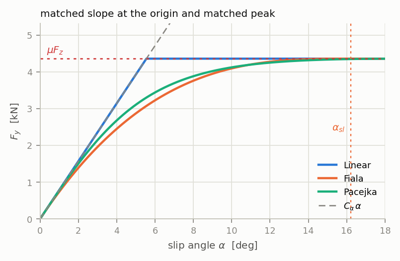

### 8.3 複合スリップ

前後・横で1つの摩擦の予算を共有します。摩擦楕円
$F_x^2 + F_y^2 \le (\mu F_z)^2$ を、 $F_x$ を使った残りの横力について解くと

$$
F_y \leftarrow F_y \sqrt{1 - \left(\frac{F_x}{\mu F_z}\right)^2}
$$

摩擦の半分を前後方向に使うと横力は $\sqrt{1-0.25} \approx 87\ \%$ 残り、80 % を
使うと 60 % になります。

---

## 9. 積分器

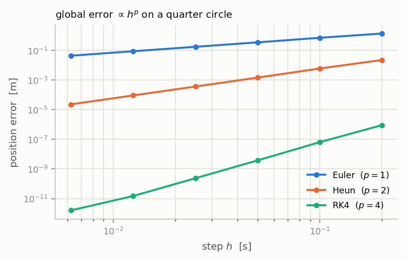

$\dot x = f(x, u)$ を、刻み $h$ の間 $u$ 一定で積分するとして、厳密解を展開します。

$$
x(t + h) = x(t) + h f + \frac{h^2}{2}\dot f + \frac{h^3}{6}\ddot f + \dots
$$

**Euler** は最初の2項しか残さないので、1ステップの誤差は最初に捨てた項
$\mathcal{O}(h^2)$ です。**Heun** は刻みの両端の傾きを平均するので $h^2/2$ の項まで
厳密に再現し、 $\mathcal{O}(h^3)$ が残ります。**RK4** は $h^4$ まで展開に一致し、
$\mathcal{O}(h^5)$ が残ります。

$$
e_{\text{Euler}} = \mathcal{O}(h^2),
\qquad
e_{\text{Heun}} = \mathcal{O}(h^3),
\qquad
e_{\text{RK4}} = \mathcal{O}(h^5)
$$

一定の終端時刻に到達するには $N = T/h$ ステップ必要なので、**大域**誤差は局所誤差
より $h$ の次数が1つ下がり、それぞれ $\mathcal{O}(h)$、 $\mathcal{O}(h^2)$、
$\mathcal{O}(h^4)$ になります。したがって刻みを半分にすると誤差は

$$
\frac{e(h)}{e(h/2)} \approx 2^{p},
\qquad p = 1,\ 2,\ 4
$$

の比で減ります。`test_integrator.cpp` は四分円軌道でまさにこの比（2, 4, 16）を測って
おり、上の図は同じ実験を Python 移植で行ったものです。両対数で傾き 1, 2, 4 の
直線3本になります。

制御周期 10 ms 程度なら RK4 で十分、実機の固定小数点実装を模す場合は Euler を選んで
ください。

---

## 図の再生成

```bash
cd python
python tools/make_model_figures.py       # docs_en/images/derivation_*.png を書き出す
```

タイヤ・ハンドリング・積分器の3枚はライブラリを実行して作っているので、モデルを
変更すれば図もそれに追随します。
