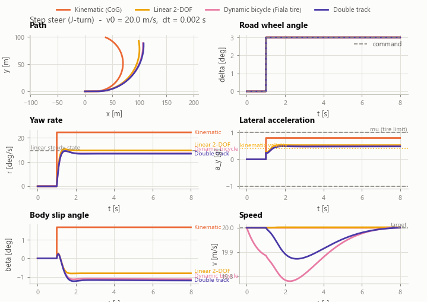
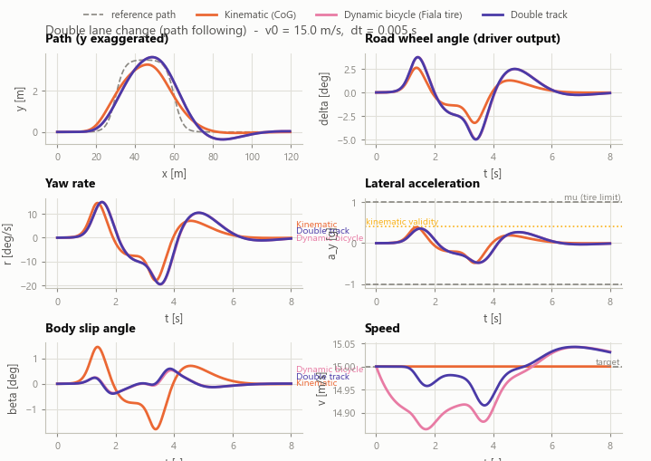
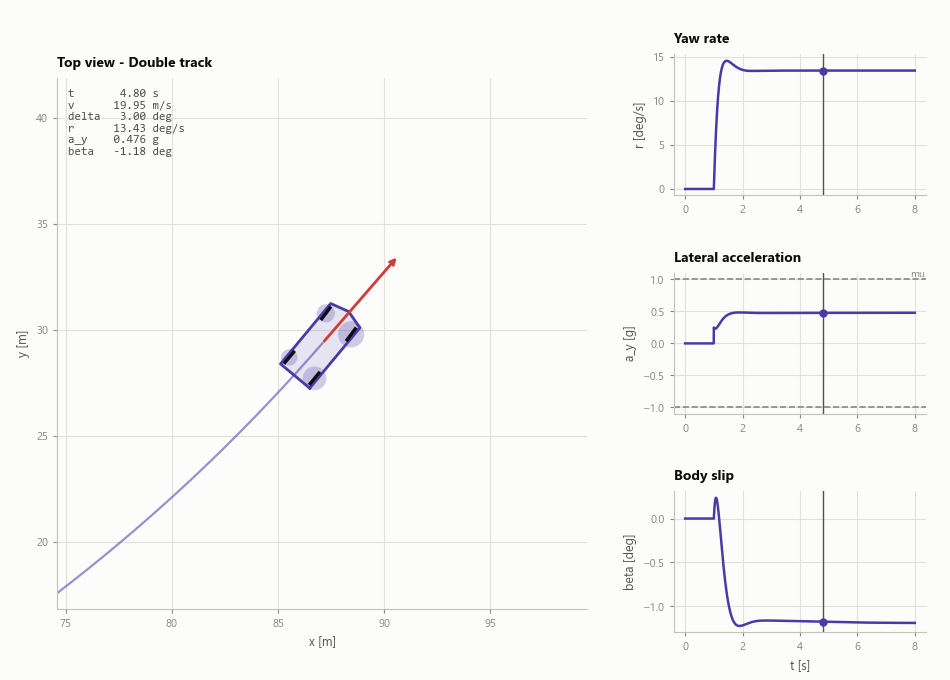
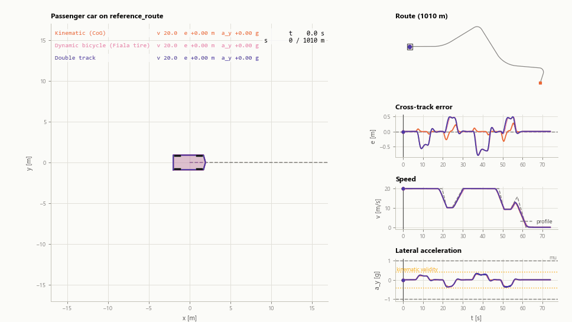
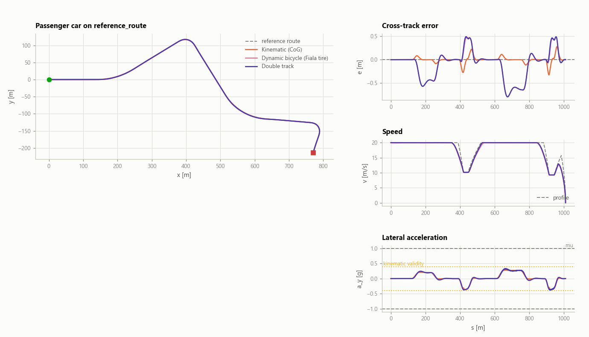
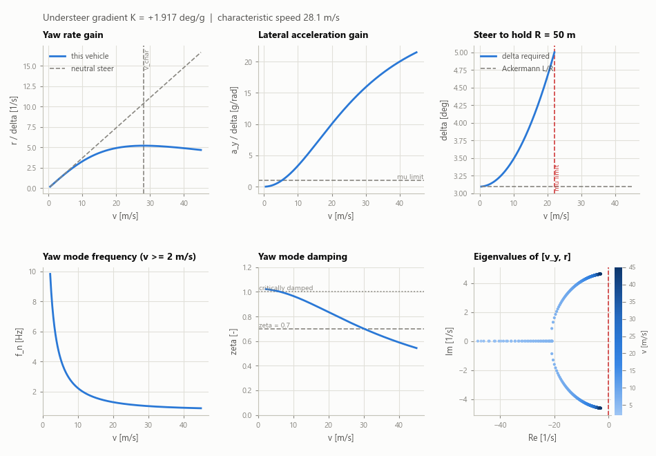
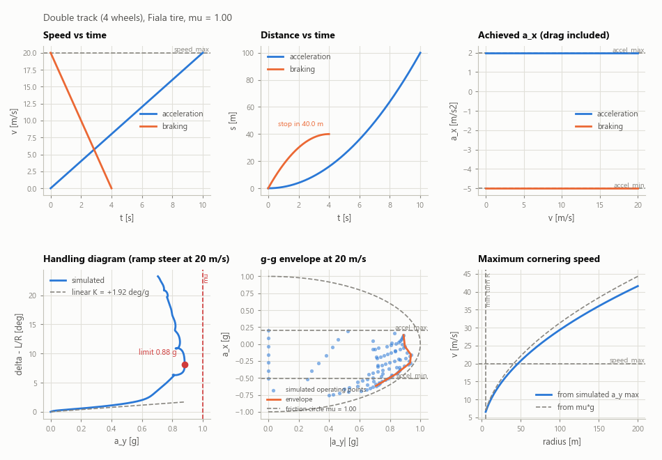
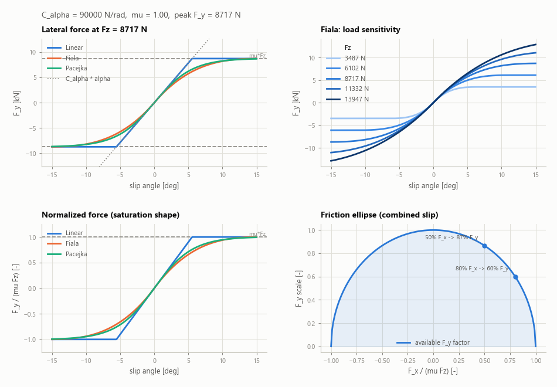
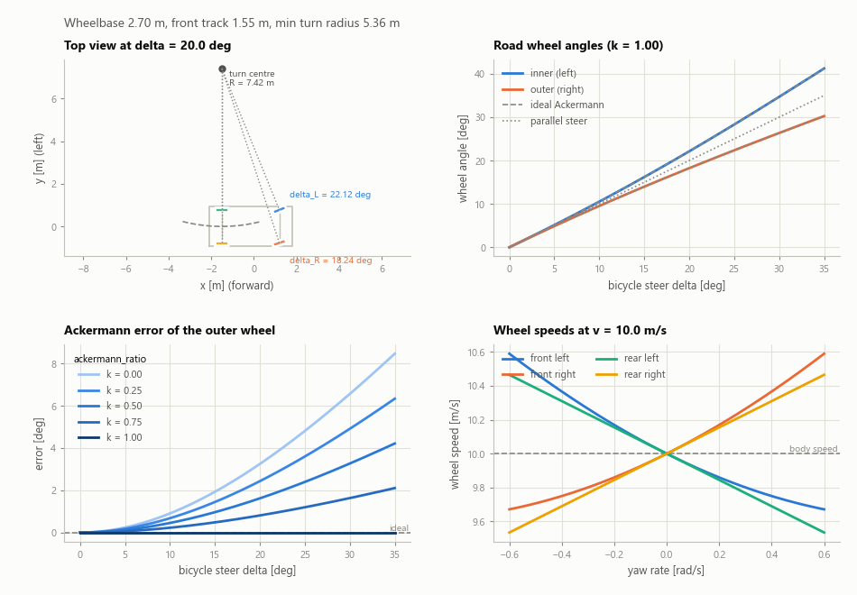

# Python シミュレーション GUI

English edition: [`docs_en/python-gui.md`](../docs_en/python-gui.md)

1 つの車両定義からライブラリの全モデルを走らせ、その違いを見せる対話型の
デスクトップアプリケーションです。数値だけでは答えられない問い —— *この操縦には
どのモデルが必要か、簡単なモデルはどこで妥当でなくなるのか、この車両は実際に何が
できるのか* —— に答えるために存在します。

モデル本体は C++ ヘッダを直接移植した
[`python/vehicle_models_py`](../python/vehicle_models_py) です。API は
[python-api.md](python-api.md)、移植の検証方法は
[validation.md](validation.md) を参照してください。

---

## 動作要件と起動

Python 3.8 以降に加えて：

```bash
cd python
pip install -r requirements.txt      # numpy, matplotlib
python run_gui.py
```

`tkinter` は Windows と macOS の標準インストーラに同梱されています。
Debian/Ubuntu では `sudo apt install python3-tk` で導入してください。

`python/` にパスが通っていれば次でも起動できます。

```bash
python -m vehicle_models_py.gui
```

インストールもビルドも不要です。パッケージは純粋な Python で、C++ のビルドから
独立しています。

---

## 画面構成

```
+----------------------+-------------------------------------------------+
| 車両                 |  操縦 | アニメーション | ハンドリング解析 |      |
|  プリセット選択      |  性能 | タイヤモデル | アッカーマン        |      |
|  約25個のパラメータ  |                                                 |
|  検証メッセージ      |     操作部    |            プロット             |
|  派生量              |               |            指標テーブル         |
+----------------------+-------------------------------------------------+
| ステータスバー                                                         |
```

**左の車両パネルは全タブ共通**です。どのタブも同じ `VehicleParameters` を読むので、
タブを切り替えても議論している車両は変わりません。フィールドを編集したら
**Apply** を押してください。値は C++ 構造体と同じ `validate()` 規則で検査され、
不正な設定は黙って使われるのではなくメッセージ付きで拒否されます。**Reset** は
選択中のプリセットを再読み込みします。

プリセット：*Passenger car*（ライブラリの既定）、*Low-speed shuttle*、
*Off-road buggy*、*Oversteering car*（前後軸のコーナリングスティフネスを入れ替えた
乗用車。ハンドリング解析で最も分かりやすい例）。

ボタン下の **Derived** ボックスは Apply のたびに更新され、多くの場合これだけで
用が足ります：ホイールベース、重量配分、静的軸荷重、アンダーステア勾配 $K$、
スタティックマージン、ニュートラルステアポイント、特性速度または限界速度、横加速度
の上限 $a_{y,\max} = \mu g$、最小回転半径、フルロック時のハンドル角。

小さな画面で窮屈なときは **View → Vehicle panel** で左列を隠せます。パネル間の
仕切りはドラッグで動かせます。

角度は画面上のどこでも **度** で入出力しますが、内部は C++ ライブラリと同じく SI・
ラジアンです。

---

## 操縦（Manoeuvre）タブ



入力は 1 つ、モデルは複数、プロットは同じ。**モデル選択を数字で見せる**タブです。

### 操作項目

| 項目 | 意味 |
|---|---|
| Type | 操縦の種類（下記一覧）。選択した操縦が読まない項目はグレーアウトされます |
| Duration / Time step | シミュレーション時間と固定積分刻み |
| Speed | 初期速度、および速度コントローラの目標値 |
| Hold speed (PI) | 速度に PI ループを掛けます。これがないと、横運動でダイナミックモデルだけが旋回抵抗で減速し、キネマティックモデルは減速しないため、異なる動作点同士を比較することになります |
| Steer amplitude / Input start | ステップ・正弦波の振幅と入力開始時刻 |
| Sine frequency | 正弦波操縦の周波数 |
| Ramp rate | ランプ操舵の操舵速度 |
| Radius | 定常円旋回の目標半径 |
| Brake a_x / Brake start | 減速度とその開始時刻 |
| Lane offset / Section length | 経路追従系操縦の幾何 |
| Models | 実行するモデル。各モデルには固定色が割り当てられ、全プロットで共通です |
| Tire model | Linear / Fiala / Pacejka。同じコーナリングスティフネス $C_\alpha$、同じピーク $\mu F_z$ に合わせてあるので、違うのは飽和の形だけです |
| Integrator | Euler / Heun / RK4 |

### 操縦の種類

- **ステップ操舵（J ターン）** — 古典的なヨー応答試験。ヨーレートのプロットに引かれ
  る基準線は線形モデルの定常解です。
- **ランプ操舵** — 操舵をゆっくり増やす。性能タブのハンドリング線図の基礎。
- **正弦波操舵** / **正弦波＋ドウェル** — 周波数応答と、第2ピークで 500 ms 保持する
  NHTSA 形式の試験。
- **定常円旋回** — 線形解析が要求半径に対して必要とする舵角を、1秒かけて立ち上げて
  保持します。
- **旋回制動** — ステップ操舵に制動フェーズを加えたもの。複合スリップと荷重移動が
  効き、単輪モデルとダブルトラックモデルの差が出始めるケースです。
- **直線加速／制動** — 全開加速のあと制動。
- **スラローム** / **ダブルレーンチェンジ** — 閉ループ。Pure Pursuit のドライバ
  モデルが基準経路を追従するので、同じ開ループ入力ではなく**同じドライバの下で**
  モデルを比較できます。
- **基準ルート** — [`data/reference_route.csv`](../data/README.md) の 1 km の道路を、
  曲率から計画した速度プロファイルで走る閉ループ。下記
  [ルート追従](#ルート追従) を参照。

### プロットの読み方

- **経路** — 各モデルの軌跡と、閉ループ操縦では基準経路。縦横比が極端な操縦
  （レーンチェンジなど）では y 軸が強調され、その旨がタイトルに出ます。
- **実舵角** — モデルごとの実際の舵角と指令値。指令に遅れるのはアクチュエータ
  モデルだけです。経路追従系ではこのプロットがドライバの出力になります。
- **ヨーレート** — 線形の定常値を基準線として重ねてあります。
- **横加速度** — タイヤ限界 $\mu g$ と、キネマティックモデルが妥当でなくなる
  $0.4\ g$ の線つき。
- **車体スリップ角** — 符号に注目してください。キネマティックモデルは左旋回で常に
  $\beta > 0$ ですが、ダイナミックモデルは

  $\displaystyle v > \sqrt{\frac{l_r L C_r}{m l_f}}$

  すなわち後軸が横力を出すためにスリップ角を必要とする速度を超えると負に転じます
  （線形の定常解 $\beta = \left(l_r - m l_f v^2/(L C_r)\right)/R$ と比較）。この
  符号反転が、キネマティックモデルの妥当限界を示す最も分かりやすい単一の症状です。
- **速度** — 動作点と、速度コントローラがどれだけ働いたか。

下の表には、ヨーレートのピーク値と定常値、オーバーシュート、90 % 応答時間、横加速度
のピーク、車体スリップ角のピーク、最終速度が並び、最終行に線形の解析解が入ります。

**Export CSV** は全モデルの全チャネルを 1 枚の横長テーブル（`<model>.<channel>`
列）として書き出します。

### 閉ループの例



同じドライバでも、ダイナミックモデルは明らかに大きな操舵を必要とし、基準経路に対して
遅れます。タイヤが力を出す前にスリップ角を立ち上げる必要があるためで、キネマティック
モデルにはこの遅れがありません。

---

## アニメーションタブ



直前の操縦を再生します。モデルを選んで **Play** を押すか、時間スライダを
ドラッグしてください。

- 車体外形と、実際の舵角で描かれる4輪（ダブルトラックモデルは左右前輪を別々に切り
  ます。これがアッカーマン幾何の働きです）。
- **各車輪の下の円盤は輪荷重に比例して大きさが変わります。** 荷重移動が目に見えます：
  左旋回では右側の円盤が大きくなり、制動では前側が大きくなります。単輪モデルは軸荷重
  を左右均等に配分するので、円盤は前後にしか動きません。
- 赤い矢印は重心の速度ベクトルで、車体軸との角度が車体スリップ角です。
- HUD と左側の数値表示が瞬時値を示します（軸のスリップ角と4輪の輪荷重を含む）。
- 右の3つのプロットは走行全体を表示し、現在時刻にカーソルが立ちます。

`Playback rate` は実時間に対する倍率、`View span` はカメラ窓の幅 [m] です。

---

## ルート追従



上記の操縦はいずれも 100 m 程度で、1 つの操舵入力で形が決まります。一方ルートは
半径の異なるコーナーを含む 1 km の道路で、問いが変わります：*同じドライバの下で、
各モデルは道路からどれだけ外れ、それはどこか？*

操縦タブの `Reference route` は
[`data/reference_route.csv`](../data/README.md) —— 直線・クロソイド遷移・最小半径
25 m の4つのカーブからなる 1010 m —— を走ります。選択するとゴールに届く長さの
Duration が自動で入り、`Speed` は走り出しの速度を決めるだけになります（以後の速度は
ドライバが自分で計画するため）。

同じ走行をコマンドラインから（上のアニメーションつき）：

```bash
cd python
python demo_route.py                                   # 画面で再生
python demo_route.py --save route.gif --rate 8         # 書き出し
python demo_route.py --models all --overview route.png
python demo_route.py --route my_course.csv --preset shuttle
```

### ドライバ

全モデルで同じドライバを使うので、画面に残る差はモデルの差です。

- **横方向** — ルートに対する Pure Pursuit。前方注視距離 $L_d$ と目標点への角度
  $\eta$ から

  $\displaystyle L_d = \mathrm{clamp}(4 + 0.5\ v,\ 3,\ 18)\ [\mathrm{m}], \qquad \delta = \arctan\frac{2 L \sin\eta}{L_d}$

  目標点は、車両を*ルート上に投影した点*から弧長で $L_d$ だけ先に取ります。 $x$ では
  なく弧長で探すので、道路が任意の角度に曲がっていても構いません。
- **前後方向** — ルートの曲率 $\kappa$ から一度だけ計算した速度プロファイル

  $\displaystyle v = \min\left(\sqrt{\frac{0.35\ \mu g}{\lvert \kappa \rvert}},\ v_{\max}\right)$

  に、`accel_min` による後ろ向きパス（コーナー手前から減速を始めるため）と
  `accel_max` による前向きパス（車両が実現できるプロファイルにするため）を掛けた
  もの。これを PI で追従し、さらに前方のプロファイルをプレビュー走査して早めに制動を
  かけます。
- 全モデルを**後軸基準で操舵**します。キネマティックモデルはもともとその点を積分して
  いますが、それ以外は姿勢を $l_r$ だけ後ろへずらしてから使います。

  $\displaystyle x_r = x - l_r \cos\psi, \qquad y_r = y - l_r \sin\psi$

  これをしないと、半数のモデルが 1.5 m 前方の点を基準に操舵され、その分だけ毎回
  コーナーをショートカットしてしまいます。

### アニメーションの読み方

- カメラは集団を追い、モデルが散らばると自動的に画角を広げます。ミニマップは集団が
  ルートのどこにいるかを示します。
- **横偏差** はルートからの符号付き距離で、後軸で測っています。進行方向左側が正です。
- **速度** には基準プロファイルが破線で入ります。コーナー進入での乖離は、プロファイル
  が変わったのではなくモデルが減速しきれていないことを意味します。
- **横加速度** には限界 $\mu g$ と、キネマティックモデルが正当化できる $0.4\ g$ の線が
  入ります。プロファイルは $0.35\ \mu g$ で計画されているので、走行全体が設計上その線の
  すぐ下に収まります。つまりここは、キネマティックモデルが妥当で*あるはず*の領域です。



乗用車プリセットで、最大 0.37 g の 1 km 走行：

| モデル | max &#124;e&#124; | rms e | ゴール時刻 |
|---|---|---|---|
| キネマティック（重心） | 0.33 m | 0.08 m | 61.0 s |
| 単輪ダイナミック（Fiala） | 0.79 m | 0.28 m | 61.6 s |
| ダブルトラック（Fiala） | 0.80 m | 0.28 m | 61.1 s |

キネマティックモデルはダイナミックモデルの 2 倍以上正確にルートを追従します。ただし
それはモデルが優れているからではなく、**他のモデルが外れる原因を表現できていない**
からです。キネマティックモデルのタイヤはスリップ角なしで力を出すため、舵角どおり
きっかり曲がります。ダイナミックモデルはまずスリップ角が立ち上がる必要があるので、
コーナー進入のたびに膨らみます。誤差の波形がまさにそれを示しています：直線では平坦、
カーブごとに山、最大は半径 25/30 m の2箇所。キネマティックモデルだけで検証した経路
追従制御は、存在しない車両に対して調整されていることになります。

**`--models linear2dof` は一度見ておく価値があります。** 線形2自由度モデルは構造上
前後速度が一定なので、コーナーの手前で減速することもゴールで停止することもできません。
半径 25 m のカーブに 20 m/s で進入するため、幾何だけでも

$$
a_y = \frac{v^2}{R} = \frac{(20\ \mathrm{m/s})^2}{25\ \mathrm{m}}
      = 16\ \mathrm{m/s^2} \approx 1.6\ g
$$

を要求し、実際には $\mu = 1.0$ のタイヤに 1.76 g を要求して、ルートから 17 m 外れて
終わります。これはバグではなく、定速前提の設計プラントにコースを走らせた結果であり、
アニメーションはその仮定を可視化しています。

---

## ハンドリング解析タブ



完全に解析的です。ここに出るものはすべて線形単輪モデルの解析解なので、パラメータを
変えると即座に再描画されます。何かを走らせる前に、*そのパラメータセットがどういう
車両を表しているか*を把握するのに使ってください。

- **ヨーレートゲイン**

  $\displaystyle \frac{r}{\delta} = \frac{v}{L + K v^2}$

  と、ニュートラルステアの基準 $v/L$。アンダーステア車では特性速度
  $V_{ch} = \sqrt{L/K}$ でピークを取り、オーバーステア車では限界速度
  $V_{cr} = \sqrt{-L/K}$ で発散します（赤で表示）。
- **横加速度ゲイン** $a_y/\delta = v^2/(L + K v^2)$ と限界 $\mu g$。この線より上は
  線形予測が物理的に到達不可能な領域です。
- **半径を保つための舵角**。アッカーマン項とスリップ項に分解して表示します。

  $\displaystyle \delta = \underbrace{\frac{L}{R}}_{\text{幾何}} + \underbrace{K a_y}_{\text{タイヤスリップ}}$

  曲線は $v^2/R$ が $\mu g$ を超えるところで打ち切られます。
- **ヨーモードの固有振動数と減衰比**の速度依存（ $1/v_x$ 項が支配的でなくなる
  2 m/s 以上）。 $A$ の固有値から

  $\displaystyle \omega_n = \sqrt{\det A}, \qquad \zeta = -\frac{\mathrm{tr} A}{2\sqrt{\det A}}$

  不安定な速度域には網掛けが入ります。
- **固有値の軌跡**（ $[v_y,\ r]$ 系、速度で色分け）。右半平面へ渡るところ
  $\mathrm{Re}\lambda > 0$ が限界速度です。

表は同じ量を数値で示し、それぞれに短い読み方が添えられます。

**試してみてください：** *Oversteering car* プリセットを選ぶと $K$ が負になり、特性
速度の代わりに約 27 m/s の有限な限界速度が現れ、ヨーレートゲインがそこで発散し、固有値
軌跡が同じ速度でゼロを横切ります。そのうえで操縦タブで 30 m/s のステップ操舵を走らせ
ると、同じ発散が時間領域で見られます。

---

## 性能タブ



車両が実際に何をできるか。**Run performance suite** を押してください（数秒。バック
グラウンドで実行され、進捗が表示されます）。

- 全開加速と制動の **速度・距離の時間波形**。
- **達成 $a_x$ の速度依存** — 指令加速度から走行抵抗を引いたもの

  $\displaystyle a_x = a_{x,\text{cmd}} - \frac{F_{\text{res}}(v)}{m}$

  なので、速度が上がるほど達成値が落ちます。
- **ハンドリング線図** — ゆっくりしたランプ操舵から得た $\delta - L/R$ 対 $a_y$。
  原点付近の傾きがそのままアンダーステア勾配

  $\displaystyle K = \left.\frac{\partial}{\partial a_y}\left(\delta - \frac{L}{R}\right)\right|_{a_y \to 0}$

  です（解析解の $K$ を基準線として描画）。曲線が折り返すところがタイヤ限界で、
  マークした点がそのモデルが到達する最大横加速度です。
- **g-g 線図** — 前後加速度指令と舵角のグリッド上で実際に達成された加速度。比較用に
  質点の摩擦円 $a_x^2 + a_y^2 \le (\mu g)^2$ を重ねます。上下が平らになるのはタイヤ
  ではなくアクチュエータ限界 `accel_max` / `accel_min` によるものです。
- **半径ごとの最大旋回速度** — シミュレーションによる限界と、質点の上限
  $v_{\max} = \sqrt{\mu g R}$。

表には最高速度、0–30/50/100 km/h の加速時間、制動距離（質点の理想値
$s = v_0^2/(2\mu g)$ との比較）、限界横加速度の $a_{y,\max}/(\mu g)$、ランプ操舵から
実測したアンダーステア勾配と解析解の比較が並びます。実測 $K$ と解析解 $K$ が一致して
いれば、パラメータセットとタイヤモデルに矛盾がないという良い確認になります。

`Model` はスイート全体で使うモデル（単輪／ダブルトラック）を選びます。両者の限界
横加速度の差が、荷重移動と輪別飽和の効果です。

---

## タイヤモデルタブ



3つのタイヤモデルはいずれも $\alpha = 0$ でのコーナリングスティフネスとピーク
$\mu F_z$ を揃えてあるので、比較対象として残るのは飽和の形だけです。

- **横力 対 スリップ角**（1つの荷重で）。線形接線 $C_\alpha \alpha$ と上限 $\mu F_z$
  つき。
- **荷重感度** — 1つのモデルを5つの輪荷重で。ピーク力は荷重に比例して増えるのに傾きは
  増えないことに注目してください。荷重移動がグリップを失わせる理由がこれです。
- **正規化力** $F_y/(\mu F_z)$ — 飽和の形そのもの。線形タイヤの折れ、Fiala の滑らかな
  3次立ち上がり、Magic Formula のピーク後の低下。
- **摩擦楕円** — 摩擦の一部を前後方向に使ったとき、横力がどれだけ残るか：

  $\displaystyle \frac{F_y}{F_{y,0}} = \sqrt{1 - \left(\frac{F_x}{\mu F_z}\right)^2}$

  摩擦の 50 % を制動に使うと横力は $\sqrt{1 - 0.5^2} \approx 87\ \%$ 残り、80 % を使うと
  $\sqrt{1 - 0.8^2} = 60\ \%$ になります。

**Load from vehicle** は、現在の車両パラメータと選択した軸から荷重・摩擦の入力欄を
埋めます。

---

## アッカーマンタブ



- **上面図**（指定した舵角で）：左右前輪をそれぞれの舵角で描き、共通の旋回中心と、
  中心から各輪への線を引きます。理想アッカーマンなら4本の線が1点で交わります。
- **実舵角 対 二輪モデル舵角**。理想アッカーマン曲線と平行操舵の直線を比較用に併記。
- **外輪のアッカーマン誤差** を `ackermann_ratio` $k$ の5通りの値で表示。実際のラックが
  持つ理想幾何からのずれ $\delta_{\text{outer}} - \delta_{\text{outer,ideal}}$ です。
- **車輪速 対 ヨーレート**（指定速度で）。車輪速センサが見る量であり、オドメトリや
  スリップ推定の基礎になります。

表には内外輪の舵角、アッカーマン誤差、旋回半径、フルロック時の最小回転半径、ハンドル
角、車輪速の広がりが出ます。

---

## 実験例

**1. キネマティックモデルはどこで破綻するか？**
操縦タブ、ステップ操舵、モデルは *Kinematic (CoG)* ＋ *Dynamic bicycle*。5 m/s で
走らせると両者のヨーレートは重なります。20 m/s では、キネマティックモデルがヨーレートを
約 1.5 倍過大評価し（既定の乗用車で 0.388 対 0.248 rad/s）、車体スリップ角の符号が
逆になります。理由は横加速度のプロットに出ています —— $0.4\ g$ の線を越えているのです。

**2. ブレンドモデルが存在する理由。**
*Low-speed shuttle* プリセットを選び、速度 0.5 m/s、ステップ 15 deg で
*Dynamic bicycle* と *Blended kinematic/dynamic* を走らせます。低速ガードを下回る領域
では素のダイナミックモデルの横運動は意味を持ちませんが、ブレンドモデルはキネマティック
予測に沿います。

**3. タイヤモデルは効くか？**
3 deg のステップ操舵では Linear / Fiala / Pacejka はほぼ同じ答えを出します。 $a_y$ が
$\mu g$ に近づくまで振幅を上げると差が出ます —— 線形タイヤはクリップ直前までスティフ
ネスを保ちますが、他の2つは手前から柔らかくなります。差の大きさは性能タブの限界横加速度
で定量化できます。

**4. 単輪 対 ダブルトラック。**
強い減速をつけた旋回制動。ダブルトラックモデルの方が横加速度を大きく失います。摩擦
楕円が移動後の輪荷重に対して輪ごとに適用されるためで、単輪モデルは軸レベルの荷重移動
しか見ていません。

**5. アッカーマン率。**
`ackermann_ratio` を 0（平行操舵）にしてアッカーマンタブを見ると、フルロックで外輪の
誤差が数度に達します。通常の走行舵角では差は無視できます —— つまり単輪モデルは歩行速度
以上では十分で、駐車操作には不十分だということです。

---

## 注意と限界

- **速度コントローラ** はアンチワインドアップ付きの PI ループで、`accel_min` /
  `accel_max` にクランプされます。

  $\displaystyle a_{x,\text{cmd}} = \mathrm{clamp}\left(K_p (v_{\text{ref}} - v) + K_i \int (v_{\text{ref}} - v)\ dt,\ a_{x,\min},\ a_{x,\max}\right)$

  キネマティックモデルではこの出力がそのまま加速度になり、ダイナミックモデルでは
  前後力 $F_x = m\ a_{x,\text{cmd}}$ になるため、達成加速度は走行抵抗の分
  $F_{\text{res}}/m$ だけ小さくなります。
- **`speed_max` はキネマティックモデルをクランプします。** 操縦の初期速度がこれを
  超えると Run ボタンの下に警告が出ます。キネマティックモデルだけが速度を制限され、
  ダイナミックモデルは制限されないため、比較が成立しなくなるからです。そのような走行
  では `speed_max` を上げてください。
- **線形2自由度モデルは構造上、前後速度が一定**です。速度波形は水平線になり、前後
  加速度は常にゼロです。
- **路面摩擦。** GUI は $\mu$（`friction`）を全モデルのタイヤへ伝播させます。C++ の
  `DynamicBicycleModel::syncTiresFromParams()` はコーナリングスティフネスしかコピー
  せず、タイヤ側の $\mu$ は既定の 1.0 のままになります。Python 移植は既定でその挙動を
  保ちますが、GUI は伝播をオプトインするため、画面上の全モデルが同じ路面を共有します。
  [python-api.md](python-api.md#摩擦係数の伝播ギャップ) を参照してください。
- **計算コスト。** 8 s・2 ms のステップ操舵を4モデルで走らせても 1 秒かかりません。
  性能スイートは数秒です。いずれも UI スレッド外で走るので、ウィンドウは応答したまま
  です。
- 経路追従操縦の Pure Pursuit ドライバは意図的に単純です。良い制御器であることではなく、
  全モデルに同じドライバを与えることが目的です。

---

## 本ドキュメントの図の再生成

```bash
cd python
python tools/make_doc_figures.py       # docs_en/images/*.png を書き出す
```

このスクリプトは GUI と同じコードパスを通るので、ドキュメントの図は常にアプリケーション
が実際に出力するものになります。
